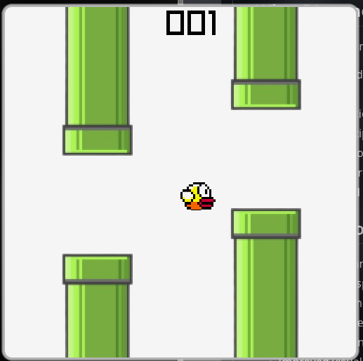

# Flappy Bird (Raylib + C++)

A recreation of the classic Flappy Bird built with **C++** and **Raylib**. This project was created to practice game programming fundamentals.

## Features

* Smooth bird movement with gravity and jumping
* Randomized pipe generation
* Collision detection
* Score tracking
* Pause system
* Restart system

## Built With

* C++
* Raylib

## Controls

| Key   | Action              |
| ----- | ------------------- |
| Space | Jump                |
| Esc   | Pause / Resume      |

## Project Structure

```text
Game
├── Bird
├── Pipe
├── Ground
└── Main/Game Loop
```

## What I Learned

This project helped me learn:

* Object-Oriented Programming in C++
* Game loops
* Collision detection
* Managing multiple game states
* Using vectors to manage game objects
* Organizing a larger C++ project
* Debugging and refactoring code

## Future Improvements

* Sound effects and music
* Animated bird sprites
* Better UI and menus
* Difficulty progression
* High score saving
* Improved visual effects



## License

This project is for learning purposes.

